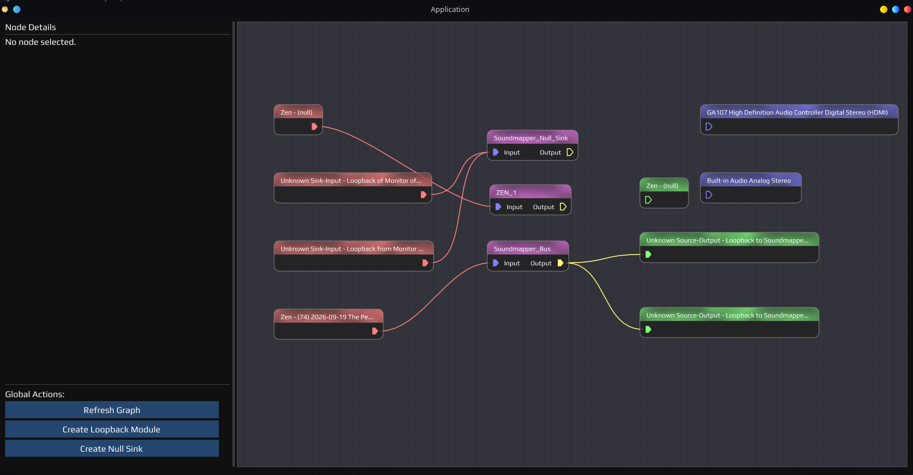

# soundmapper
> SoundMapper is a visual audio routing tool for Linux that lets you see and control how sound flows between your applications and audio devices. All through a drag-and-drop node graph, without touching any terminal commands.

```yml
-- imgui-node-editor: 0.9.2
-- nlohmann: 3.11.2
```

Routing
> SinkInput -> Sink
pactl move-sink-input <sink-input-id> <sink-id>

> Source -> SourceOutput
pactl move-source-output <source-output-id> <source-id>

### Screenshot



## SoundMapper (What AI Say's about this?)

Imagine your computer's audio as water flowing through pipes. Music from your browser flows through a pipe into your speakers. A video call flows through another pipe into your headphones. Normally, you can't see any of this — it just happens.

**SoundMapper makes those pipes visible.**

---

### What You See

When you open the app, it draws a live diagram on screen. Every app playing sound appears as a box on the left. Every speaker or audio output appears as a box on the right. A line connects them, showing you where the sound is going right now.

---

### What You Can Do

Don't want your YouTube audio going to your TV? **Drag the line** from the TV and drop it onto your headphones. That's it. The sound switches instantly.

Want the same audio playing on two outputs at once? Connect it to both. SoundMapper handles everything in the background.

---

### Why It's Useful

- You can see **all your audio at a glance** — no digging through settings menus
- You can **switch audio outputs** for specific apps without affecting others
- You can **create virtual connections** between devices that wouldn't normally talk to each other

---

### In One Sentence

> **SoundMapper is like a visual patchboard for your computer's sound — you see every audio connection on screen and change them by dragging wires, like plugging and unplugging cables on a real mixing board.**
